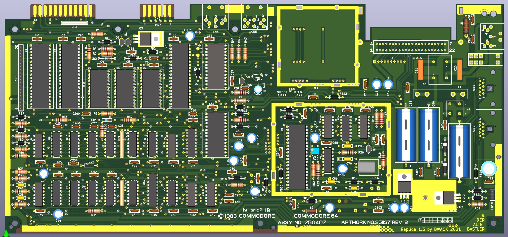
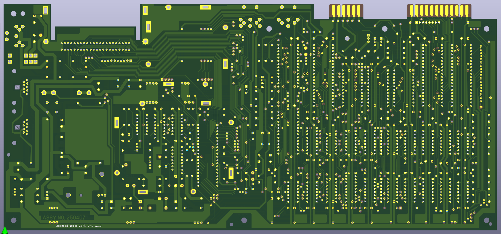

# The C64 250407 replica

A replica of the Commodore 64 Ver.250407  Rev.B motherboard, and matching schematics.

The replica project was started by Michael K. (Der Alte Bastler) in 2019 to learn SprintLayout, and the process of reverse engineering printed circuit boards. I finished the layout in SprintLayout, and imported it to KiCad. The KU motherboard schematics are nowhere to be found on the internet. Therefore I used the 250407 Reb.B schematics as reference and then modified them to match the KU motherboard layout.

The board has been prototyped and tested by Langwell Cowan and I.

We are not the first to reverse engineer this board; but we are the first to share the design files online.

# BOM

Please see the [BOM file](250407_bom.csv).

Note that some values were left blank because they depend on the clock circuit (PAL/NTSC), and PLA model. They never made it into the schematics. You can find them in a table to the right of the schematics for 250407.
http://www.zimmers.net/anonftp/pub/cbm/schematics/computers/c64/index.html

# Interactive-BOM

[The interactive bom html page](https://htmlpreview.github.io/?https://raw.githubusercontent.com/bwack/C64-250407-Replica-KiCad/main/interactive-bom/ibom.html) is a useful tool for assembling the board and finding signal traces via a web browser. To order parts, Use the BOM document listed above. (Mouser and Digikey compatable)

# Schematics

Download the PDF file [250407_.pdf](250407_.pdf) for high quality schematics.
Checkout [this tweet](https://twitter.com/paulrickards/status/1371988589974847492) by Paul Rickards where he plots the KU motherboard schematics KU-14194HB :-)

# Change log
- 2025-06-09: PCB and Schematics V1.3: PAL-NTSC jumpers fox. Thank you, Fred Sauer!
Note: V1.3 was opened and saved in KiCAD 9.0.1. I've verified the new gerbers. Things to beware of I you want to modify the design: 1. If you try to load changes from schematic into the PCBNew, KiCAD will require you to annotate the schematics, which in turn will replace all the resistor array sub parts. Example R1A will become R1A1, which will turn into new parts in PCBNew. Therefore I have not done that in this update. I have only changed the silkscreen, and I have only edited the schematics. 2. KiCAD will ask you to refill the zone fills. I have not done that because it also warns you about some change in fill-constrains. I don't remember exactly what, but I did not refill the fill zones when going to V1.3.
- 2022-08-18: Schematics V1.2: symbol and ERC fixes (Pull request from Gabriele Gorla/GGLABS)
- 2020-06-19: PCB and schematics V1.1: First release
- 2020-04-22: PCB and schematics V1.0: Prototype

# YouTube

Part 1-4:

# License and Disclaimer

Copyright Bwack 2025

This documentation describes Open Hardware and is licensed under the CERN OHL v. 1.2.

You may redistribute and modify this documentation under the terms of theCERN OHL v.1.2. (http://ohwr.org/cernohl). This documentation is distributed WITHOUT ANY EXPRESS OR IMPLIED WARRANTY, INCLUDING OF MERCHANTABILITY, SATISFACTORY QUALITY AND FITNESS FOR APARTICULAR PURPOSE. Please see the CERN OHL v.1.2 for applicable conditions.
